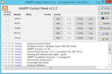
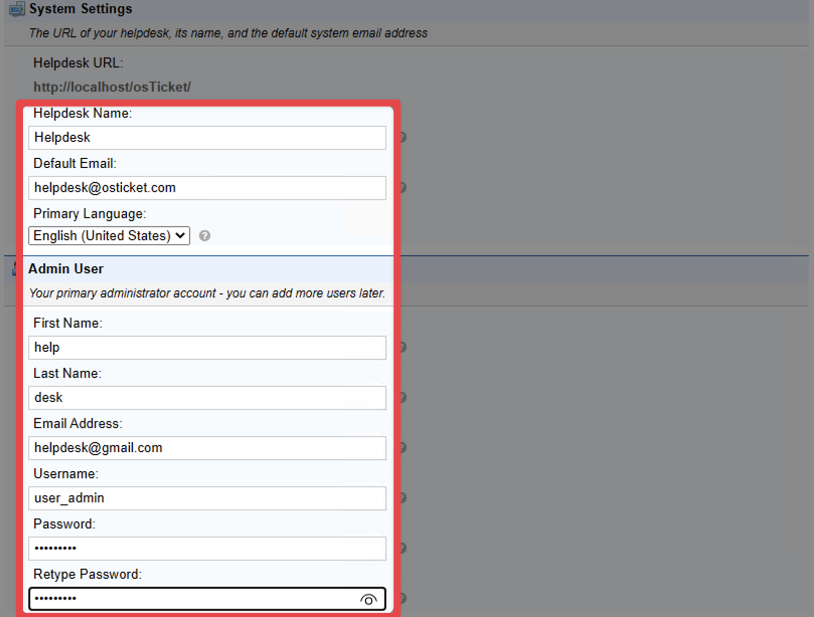
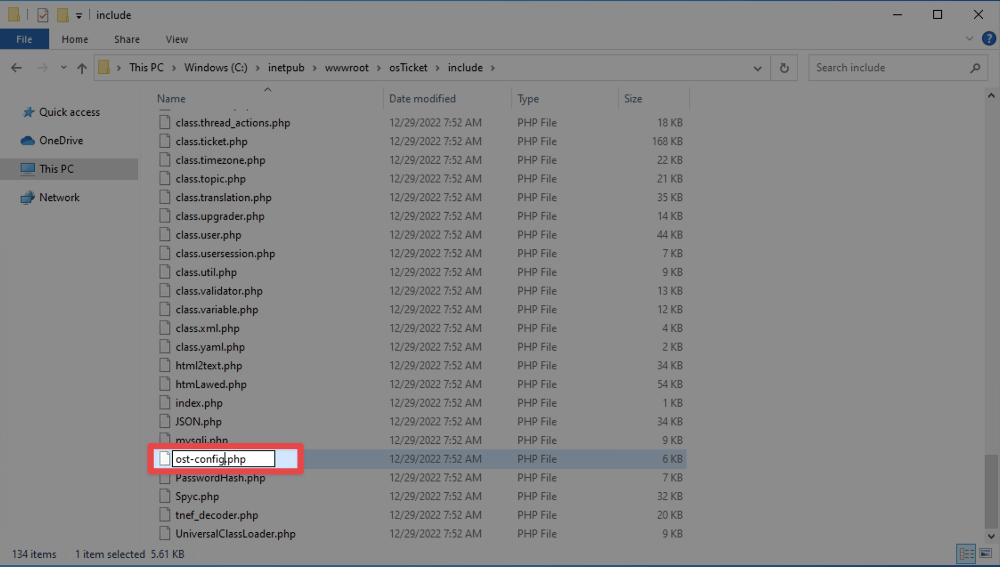

Step 1 – Install XAMPP

1. Download XAMPP
   [https://www.apachefriends.org/download.html](https://www.apachefriends.org/download.html)

2. Run the installer.

3. Select components
   Keep default options:

   * Apache
   * MySQL
   * PHP
   * phpMyAdmin

4. Install to default path

C:\xampp

5. Finish installation.

## Step 2 – Start Apache and MySQL

1. Open **XAMPP Control Panel**.

2. Start services

Apache
MySQL

3. Confirm they turn **green** (running).

## Step 3 – Download osTicket

Download from GitHub:

https://github.com/osTicket/osTicket/releases

Download the **latest ZIP file**.

## Step 4 – Extract osTicket

1. Extract ZIP file.

2. Open the extracted folder.

3. Copy the **upload** folder.

4. Paste inside:

C:\xampp\htdocs\

5. Rename the folder

upload → osticket

Final path:

C:\xampp\htdocs\osticket

---

## Step 5 – Configure osTicket Files

Navigate to:

C:\xampp\htdocs\osticket\include

Find file:

ost-sampleconfig.php

Rename it to:

ost-config.php

---

## Step 6 – Set File Permissions

Right click:

ost-config.php

Allow **write permission** if needed (sometimes required during setup).

---

## Step 7 – Create Database

Open browser:

http://localhost/phpmyadmin

Steps:

1. Click **Databases**
2. Create database

Example name:

osticket_db

Click **Create**.

---

## Step 8 – Start osTicket Installation

Open browser:

http://localhost/osticket

Installation page will appear.

Fill details:

Name: Helpdesk
Email: whichever email you want
First Name: your first name
Last Name: your last name
Email Address: whichever email you want (needs to be different from the Helpdesk's default email)
Username: user_admin
Password: Password1

---

## Step 9 – Database Configuration

Enter database details:

Database

osticket_db

Username

root

Password

(blank for XAMPP default)

Host

localhost

Click **Install Now**.

## Step 10 – Secure Installation

After installation:

Delete setup folder.

Path:

C:\xampp\htdocs\osticket\setup

Then set file permission back to **read only** for:

include/ost-config.php

---

## Step 11 – Access osTicket

User portal:

http://localhost/osticket

Admin panel:

http://localhost/osticket/scp

Login with admin credentials.

---

## Step 12 – Create Test Tickets

Example tickets for your project:

Ticket 1
Title: Printer not working

Ticket 2
Title: System running slow

Ticket 3
Title: Internet not connecting

